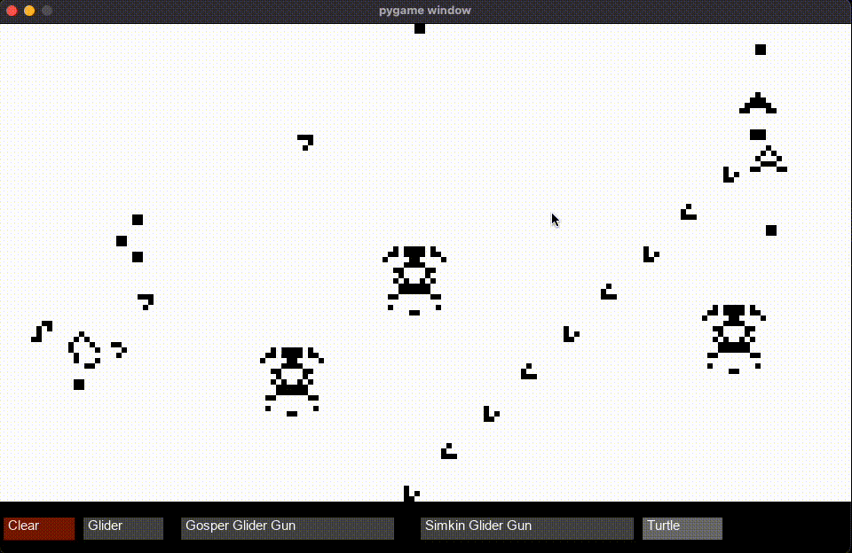

# Conway's Game of Life
The Game of Life, also known simply as Life, is a cellular automaton devised by the British mathematician John Horton Conway in 1970. (From [Wikipedia](https://en.wikipedia.org/wiki/Conway%27s_Game_of_Life))


### Usage
```sh
python3 Conway.py
```

- Press `blank space` to start/pause the population.
- Press and drag the cursor to draw arbitrary patterns.
- Click on the presets below to draw some famous patterns.

